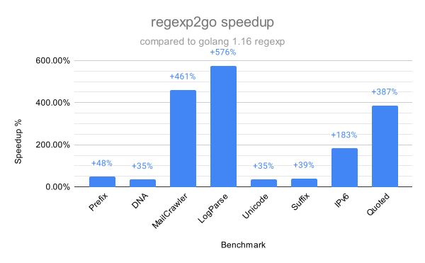

# regexp2go

regexp2go is an alternate backend for the `regexp` package that allows to
perform ahead-of-time compilation of regular expressions to Go code.

This is similar in spirit to [re2go](https://re2c.org/manual/manual_go.html),
but aiming for compatibility with the Go `regexp` package.

:warning: This is an experimental PoC that currently implements only a
subset of the functionalities and optimizations present in the full `regexp` package.
Rather importantly while it aims at offering the "run in time linear in the
size of the input" guarantee that is offered by the `regexp` package, there may be
cases in which this is not currently possible. It may also contain some correctness
bugs since the test suite is not really extensive yet.

Using code generated by this package in production is not yet recommended.

## Usage

For a quick demo you can use the [online demo](https://regexp2go-demo.herokuapp.com/), or run it locally:

```sh
$ go get github.com/CAFxX/regexp2go

# Compile the provided regular expression using the default Go regexp 
# flags (212) and save the result in gen/main.go.
# This requires regexp2go to be on your PATH.
$ regexp2go '(?m)^INFO res=([0-9]+) msg=(.*)' > gen/main.go

# The generated file contains a main function that simply calls the
# generated `Match` function (the one that implements the regular expression)
# passing the input text provided as argument.
$ go run gen/main.go 'INFO res=42 msg=ok'
0: "INFO res=42 msg=ok"
1: "42"
2: "ok"
```

To generate a Match function that can be called from your program:

```sh
# Compile the provided regular expression using the default Go regexp 
# flags (212) and save the result in re/info_line.go.
# The pkg flag specifies the package name. The fn flag specifies the
# name of the generated function.
# This requires regexp2go to be on your PATH.
$ regexp2go -pkg re -fn MatchInfoLine '(?m)^INFO res=([0-9]+) msg=(.*)' > re/info_line.go
```

## Examples

Examples of generated code are in [`examples/`](./examples).

Each example contains the generated Go code, and the disassembly of the
function that implements the regular expression.

For demo purposes you can also use the [online demo](https://regexp2go-demo.herokuapp.com/)
to compile a custom regular expression.

## Benchmarks

:warning: These are preliminary results since not all features are implemented, and some edge cases are not handled yet. At the same time, there are many possible optimizations that haven't been implemented yet. See the TODOs in the code for details.

<p align=center></p>

regexp2go can be from slightly faster to over 5 times faster than the `regexp` package in the golang standard library, depending on the regexp and the input data.
